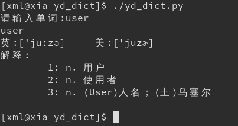
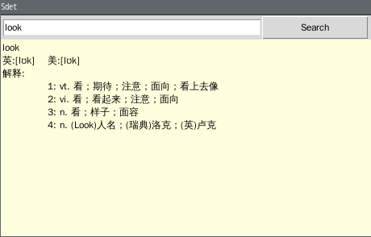

# Sdet 

**S**imple **D**ictionary **E**xpanded **T**ool

这是一个简单的词典拓展工具，界面清新，操作简单，功能精巧。

## 使用平台：
* Windowns
* Linux
* Mac OS

这是一个基于有道词典设计的一个翻译工具。
你可以仅仅在命令行下来使用它，同时它也支持GUI版。
如果是在命令行下使用它，请运行Sdet_core.py。
如果是使用GUI，请运行Sdet_ui.py。
当然Sdet_core.py也可以当作一个模块被其他的py文件调用^_^。
本软件既支持网络搜索，同时也支持本地搜索，而且本软件还集成了一个本地搜索数据库制作的脚本。

## 文件说明
|文件						|说明							  |
|-----------------------|--------------------------------|
| /doc					|说明文档文件夹					|
| /doc/*.png			|说明文档中引用到的图片资源			|
| /doc/文件作用说明.md	|本文档，用来讲解本软件各文件作用	  |
| /script				|其他文件夹						 |
| /script/Sdet_dbIndex.txt|单词基本数据库生成索引文件，会被Sdet_dbMaker.py调用来生成基本的单词数据库			|
|/script/Sdet_wordDB.db		|单词数据库						|
|/README.md				|总体说明文档						|
|/Sdet_core.py			|**词典核心功能文件	**				|
|/Sdet_dbMaker.py		|该文件用来生成基本的单词数据库		|
|/Sdet_local.py			|用来操作本地数据库的文件			|
|/Sdet_ui.py			|**GUI界面显示文件**				|

**说明**：
命令行使用请运行文件:Sdet_core.py
GUI模式请运行文件:Sdet_ui.py

## 使用介绍:

* 安装python3.x
* 本地数据库生成
* 软件运行机制
* 软件使用
* 汉译英

### 安装python3.x

略

### 本地数据库生成

本软件默认自带一个含有2000基本词汇的本地数据库，该数据库位于{rootdir}/script/Sdet_wordDB.db

如果本软件运行时，该数据库文件不存在，那么软件会自动创建一个空的数据库。如果本地数据库损毁，本软件提供一下方法恢复基本的数据库：
方法一：从软件下载的地方重新下载一份DB文件，放置到script下
方法二：用本软件自带的DB制作脚本工具  
本工具有重新制作一份全新的DB和在现有DB基础上恢复成默认数据DB
**全新制作DB**

1. 制作数据索引文件，将需要导入数据库的单词添加到数据库生成索引文件{rootdir}/script/Sdet_dbIndex.tx中，每一行表示一个单词，一行只需要有一个单词即可，其他的行号、注释的都是无效的文本，会自动忽略，不要有空白行  
2. 运行脚本Sdet_dbMaker.py，选择第1项功能

```
E:\python_code\Sdet>python Sdet_dbMaker.py
1-数据库制作
2-数据库恢复
请选择操作:1
```

然后等待数据库制作完成，如果索引量比较大的话，数据库生成可能比较慢，这也跟网络有关  


**数据库恢复功能**
该操作会将现有数据库恢复到默认状态，运行脚本Sdet_dbMaker.py，选择第2项功能

```
E:\python_code\Sdet>python Sdet_dbMaker.py
1-数据库制作
2-数据库恢复
请选择操作:2
```

### 软件运行机制

本软件运行后会请求一个查询单词，支持英文和中文查询，软件首先会在本地数据库中进行搜索本单词的解释，如果本地数据库中有本单词的解释，则直接使用这个解释。如果本地数据库中无该单词的解释，本软件会从网络获取解释，获取成功后该解释会自动写入本地数据库，以供下次搜索是能直接从本地数据库中搜索。

### 软件使用  
**说明**：
命令行使用请运行文件:Sdet_core.py
GUI模式请运行文件:Sdet_ui.py

* **命令行无参数时，软件会提示输入查询的单词**  
Windows: 

```
E:\python_code\Sdet>python Sdet_core.py
请输入单词:start
start
英:[stɑːt]      美:[stɑrt]
解释:
        1: vt. 开始；启动
        2: vi. 出发
        3: n. 开始；起点


E:\python_code\Sdet>
```

Linux: 

```
[xml@qiuzhiqian Sdet]$ python Sdet_core.py 
请输入单词:name
the
英:[ðə;ði:]	美:[ðə; ði]
解释:
	1: art. 这；那
	2: adv. 更加（用于比较级，最高级前）

[xml@qiuzhiqian Sdet]$
```

或者

```
[xml@qiuzhiqian Sdet]$ ./Sdet_core.py 
请输入单词:look
look
英:[lʊk]	美:[lʊk]
解释:
	1: vt. 看；期待；注意；面向；看上去像
	2: vi. 看；看起来；注意；面向
	3: n. 看；样子；面容
	4: n. (Look)人名；(瑞典)洛克；(英)卢克

[xml@qiuzhiqian Sdet]$
```

* **命令行带参数  ** 
* 
命令行带参数时，参数即为查询的单词  

Windows:

```
E:\python_code\Sdet>python Sdet_core.py stop
stop
英:[stɒp]       美:[stɑp]
解释:
        1: vt. 停止；堵塞；断绝
        2: vi. 停止；中止；逗留；被塞住
        3: n. 停止；车站；障碍；逗留


E:\python_code\Sdet>
```

Linux:

```
[xml@qiuzhiqian Sdet]$ python Sdet_core.py open
open
英:['əʊp(ə)n]	美:['opən]
解释:
	1: adj. 公开的；敞开的；空旷的；坦率的；营业着的
	2: vi. 开始；展现
	3: vt. 公开；打开
	4: n. 公开；空旷；户外

[xml@qiuzhiqian Sdet]$
```

或者

```
[xml@qiuzhiqian Sdet]$ ./Sdet_core.py open
open
英:['əʊp(ə)n]	美:['opən]
解释:
	1: adj. 公开的；敞开的；空旷的；坦率的；营业着的
	2: vi. 开始；展现
	3: vt. 公开；打开
	4: n. 公开；空旷；户外

[xml@qiuzhiqian Sdet]$
```

* **GUI模式**  
直接运行main_ui.py进入GUI模式，在文本框中输入单词，点击搜索即可查询翻译  

Windows:

```
E:\python_code\Sdet>python Sdet_ui.py
```


Linux:

```
[xml@qiuzhiqian Sdet]$ python Sdet_ui.py
```
或者
```
[xml@qiuzhiqian Sdet]$ ./Sdet_ui.py
```


## 汉译英  
本词典支持汉译英和英译汉，前面的实例是英译汉的，下面演示汉译英  

Windowns:

```
E:\python_code\Sdet>python Sdet_core.py
请输入单词:开始
开始
拼音:[kāi shǐ]
解释:
        1: n.   initiation
        2: vt.  begin
        3:  ;   start
        4:  ;   initiate


E:\python_code\Sdet>
```

Linux:

```
[xml@qiuzhiqian Sdet]$ python Sdet_core.py 开门
开门
拼音:[kāi mén]
解释:
	1: open the door

[xml@qiuzhiqian Sdet]$
```

**如果你觉得我的软件对你有帮助，那就捐助我吧：**


